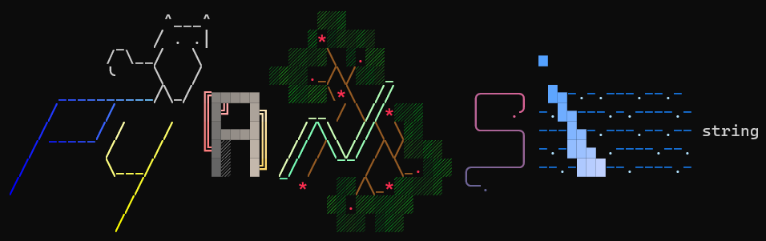

# pyansistring



[***`pyansistring`***](https://github.com/l1asis/pyansistring) is a small library for fast **color styling** of the string using **ANSI escape sequences**. The base class inherits from Python's `str`. You can split, join, slice the string while preserving the styling. 

Inspired by [***`rich`***](https://github.com/Textualize/rich) Python library.

## **Features**
- Preservation of the `str` methods.
- RGB foreground and background coloring.
- Per-word coloring.
- Align left, right and center without the problems caused by the length of the string.

#### For a more comprehensive list of what's been done so far, see the [***TODO***](./TODO.md) section.

## **Install**
Since the library is not (yet, but I'll do it) published on [PyPI](https://pypi.org/), it can only be used directly or installed with pip:
```
git clone https://github.com/l1asis/pyansistring
```
```
# current directory: /pyansistring
pip install .
```

## **Contributing**
Any ideas (vectors) for improvements, actual help with implementations, bug fixes 
and anything else is highly appreciated. You can also contribute by adding your 
own art to the `arts.py` file in the `.\src\pyansistring` directory if you like.

## **Usage**
```python
from pyansistring import ANSIString
from pyansistring.constants import SGR, Foreground, Background

# Does what it should: prints all text in bold, with magenta foreground and white background.
print(ANSIString("Hello, World!").fg_4b(Foreground.MAGENTA).bg_4b(Background.WHITE).fm(SGR.BOLD))

# But you can do the same on a specific slice:
print(ANSIString("Hello, World!").fg_4b(Foreground.MAGENTA, (0, 4)).bg_4b(Background.WHITE, (2, 4)).fm(SGR.BOLD, (4, 6)))

# Or if you want to apply styles to a specific word
print(ANSIString("Hello, World!").fg_4b_w(Foreground.MAGENTA, "Hello", "World").bg_4b_w(Background.WHITE, "World").fm_w(SGR.BOLD, ","))

# You may find predefined colors boring, let's do it with RGB:
print(ANSIString("Hello, World!").fg_24b(255, 0, 255).bg_24b(255, 255, 255))

# And of course you can do the same tricks with words:
print(ANSIString("Hello, World!").fg_24b_w(255, 0, 255, "Hello").bg_24b_w(255, 255, 255, "World"))

# By the way...
print(len(ANSIString("Hello, World!").fg_4b(Foreground.MAGENTA)) == len("Hello, World!"))
# -> True

# Why? Because I wanted it to behave this way. But at the same time:
print(len(ANSIString("Hello, World!").fg_4b(Foreground.MAGENTA).styled) == len("Hello, World!"))
# -> False
print(ANSIString("Hello, World!").fg_4b(Foreground.MAGENTA).actual_length == len("Hello, World!"))
# -> False

# If you need the original string:
print(ANSIString("Hello, World!").fg_4b(Foreground.MAGENTA).plain)
```