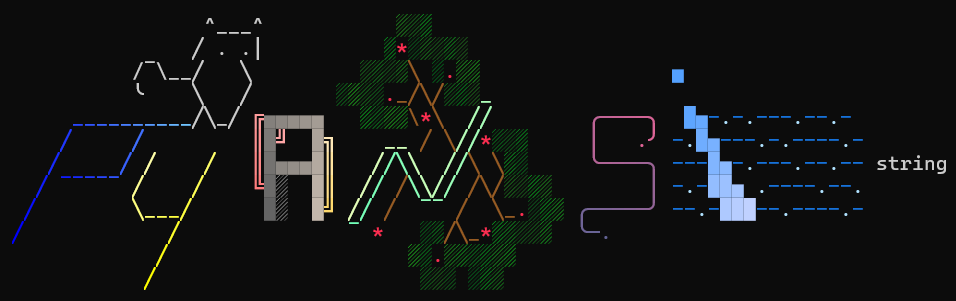

# pyansistring


## About The Project

[***pyansistring***](https://github.com/l1asis/pyansistring) is a library for **string color styling** using **ANSI escape sequences**. The base class inherits from Python's `str`. You can split, join, or slice the string while **preserving the styling**.

### Features

* Preservation of the str methods.
* Support for 4-, 8-, and 24-bit (True Color) color modes.
* Per-word coloring.
* Left, right, and center alignment without problems caused by string length.
* Support for multiple SGR (Select Graphic Rendition) parameters.
* Support for both the traditional ";" and the modern ":" SGR parameter separators.
* Automated coloring functionality, e.g., rainbow text.

For a more comprehensive list of what's been done so far, see the [TODO](./TODO.md) section.

Inspired by [***rich***](https://github.com/Textualize/rich) and [***colorama***](https://github.com/tartley/colorama) Python libraries.

## Getting Started

### Prerequisites

* Python 3.10 or higher
    * Linux: https://docs.python.org/3/using/unix.html
    * Windows: https://docs.python.org/3/using/windows.html
    * macOS: https://docs.python.org/3/using/mac.html
* Git (for local installation)
    * Linux: https://git-scm.com/downloads/linux
    * Windows: https://git-scm.com/downloads/win
    * macOS: https://git-scm.com/downloads/mac

### Installation

You can install the package **via pip**:
```sh
pip install pyansistring # or pip3 install pyansistring
```

Or locally **via git**:
1. Clone the repository
    ```sh
    git clone https://github.com/l1asis/pyansistring
    ```
2. Navigate to the cloned directory
    ```sh
    cd pyansistring
    ```
3. Change git remote url to avoid accidental pushes to base project
    ```sh
    git remote set-url origin github_username/repo_name
    # Verify the changes
    git remote -v
    ```
4. (Optional) Create and activate a virtual environment
    ```sh
    python -m venv venv
    # On Windows
    .\venv\Scripts\activate
    # On Unix or MacOS
    source venv/bin/activate
    ``` 
5. Install the package
    ```sh
    pip install .
    ```

<p align="right">(<a href="#pyansistring">back to top</a>)</p>

## Usage

#### Import the necessary classes and initialize an `ANSIString` instance:
```python
from pyansistring.pyansistring import ANSIString
from pyansistring.constants import SGR, Foreground, Background, UnderlineMode
```

#### Unstyled plain string:
```python
text = ANSIString("Hello, World!")
print(text)
```


#### Style the whole string:
```python
print(
    ANSIString("Hello, World!")
        .fg_4b(Foreground.MAGENTA)
        .bg_4b(Background.WHITE)
        .fm(SGR.BOLD)
)
```


#### Style by slice (indices are \[start, end, step\]):
```python
print(
    ANSIString("Hello, World!")
        .fg_4b(Foreground.MAGENTA, (0, 5))   # "Hello"
        .bg_4b(Background.WHITE, (7, 12))    # "World"
        .fm(SGR.BOLD, (7, 12))               # "World"
)
```


#### Style by words:
```python
print(
    ANSIString("Hello, World!")
        .fg_4b_w(Foreground.MAGENTA, "Hello", "World")
        .bg_4b_w(Background.WHITE, "World")
        .fm_w(SGR.BOLD, ",")
)
```


#### SGR parameters like bold and underline:
```python
print(
    ANSIString("Hello, World!")
        .fm(SGR.BOLD)
        .fm(SGR.UNDERLINE)
)
```


#### 4-bit examples (doesn't exist for underline):
```python
print(
    ANSIString("Hello, World!")
        .fg_4b(Foreground.MAGENTA)
        .bg_4b(Background.WHITE)
)
```


#### 8-bit examples:
```python
print(
    ANSIString("Hello, World!")
        .fg_8b(201)
        .bg_8b(15)
        .ul_8b(10)
)
```


#### 24-bit (True Color) example:
```python
print(
    ANSIString("Hello, World!")
        .fg_24b(255, 0, 255)
        .bg_24b(255, 255, 255)
        .ul_24b(0, 255, 0)
)
```


#### Underline modes (not "styles" to avoid confusion with other styling):
```python
print(
    ANSIString("Hello, World!")
        .ul_8b(201)
        .fm(UnderlineMode.DOUBLE)
)
```


#### Lengths and plain text:
```python
styled = ANSIString("Hello, World!").fg_4b(Foreground.MAGENTA)

print(len(styled) == len("Hello, World!"))
# True (logical length ignores ANSI)
print(len(styled.styled_text) == len("Hello, World!"))
# False (includes ANSI codes)
print(styled.actual_length == len("Hello, World!"))
# False (includes ANSI codes)
print(styled.plain)
# "Hello, World!"
```

#### ANSIString conversion to SVG:
```python
from fontTools.ttLib import TTFont

styled = ANSIString("Hello, World!").fg_4b(Foreground.MAGENTA)
styled.to_svg(font=TTFont("path/to/font.ttf"), output_file="hello_world.svg")
```

#### Rainbow text as a separate function:
```python
print(
    ANSIString("Hello, World! This is rainbow text!")
        .rainbow(fg=True)
)
```


#### Colored text using multicolor functionality:
```python
print(
    ANSIString("Hello, World! This is multicolor text!")
        .multicolor((
            "r=0:|g=0:|b=255:   $ "  # Start with blue
            "b>0:repeat(auto)   # "  # Decrease blue
            "r>255:repeat(auto) | "  # Increase green and combine with...
            "g>255:repeat(auto)   "  # Increase red
            "                   &*"  # Cycle & Start without apply flags
        ))
)
```


<p align="right">(<a href="#pyansistring">back to top</a>)</p>

## Contributing

Contributions are what make the open source community such an amazing place to learn, inspire, and create. Any contributions you make are **greatly appreciated**.

If you have a suggestion that would make this better, please fork the repo and create a pull request. You can also simply open an issue with the tag "enhancement".
Don't forget to give the project a star! Thanks again!

1. Fork the Project
2. Create your Feature Branch (`git checkout -b feature/AmazingFeature`)
3. Commit your Changes (`git commit -m 'Add some AmazingFeature'`)
4. Push to the Branch (`git push origin feature/AmazingFeature`)
5. Open a Pull Request

**P.S.** I would love to see your arts made with ***pyansistring*** in the `arts.py` file, with proper attribution, of course!

<p align="right">(<a href="#pyansistring">back to top</a>)</p>

## License

Distributed under the MIT License. See `LICENSE` for more information.

<p align="right">(<a href="#pyansistring">back to top</a>)</p>

## Acknowledgements
* [Othneil Drew's Best README Template](https://github.com/othneildrew/Best-README-Template)

<p align="right">(<a href="#pyansistring">back to top</a>)</p>